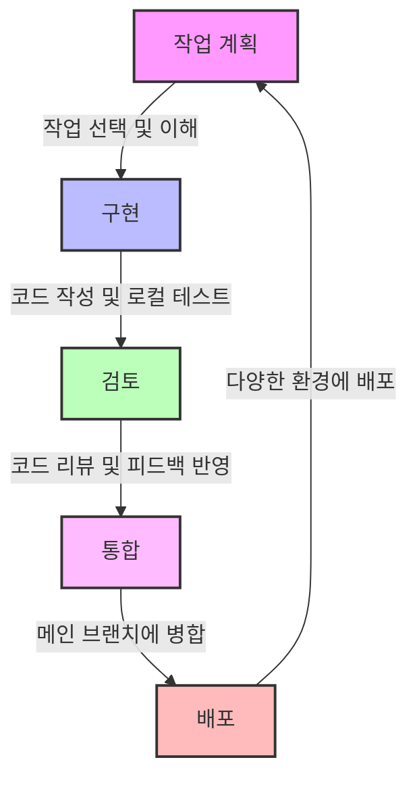

```mermaid
graph TD
    A[작업 계획] -->|작업 선택 및 이해| B[구현]
    B -->|코드 작성 및 로컬 테스트| C[검토]
    C -->|코드 리뷰 및 피드백 반영| D[통합]
    D -->|메인 브랜치에 병합| E[배포]
    E -->|다양한 환경에 배포| A
    
    style A fill:#f9f,stroke:#333,stroke-width:2px
    style B fill:#bbf,stroke:#333,stroke-width:2px
    style C fill:#bfb,stroke:#333,stroke-width:2px
    style D fill:#fbf,stroke:#333,stroke-width:2px
    style E fill:#fbb,stroke:#333,stroke-width:2px
```
